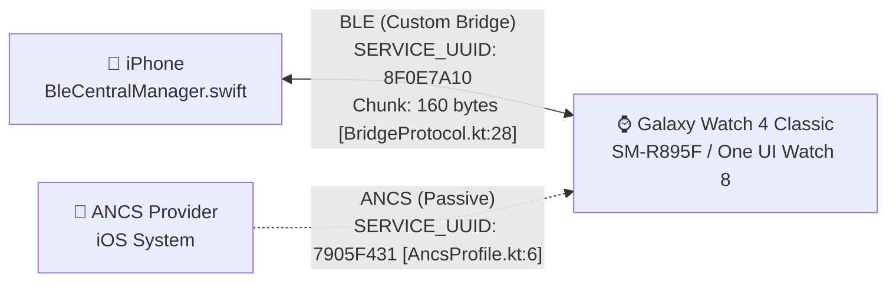
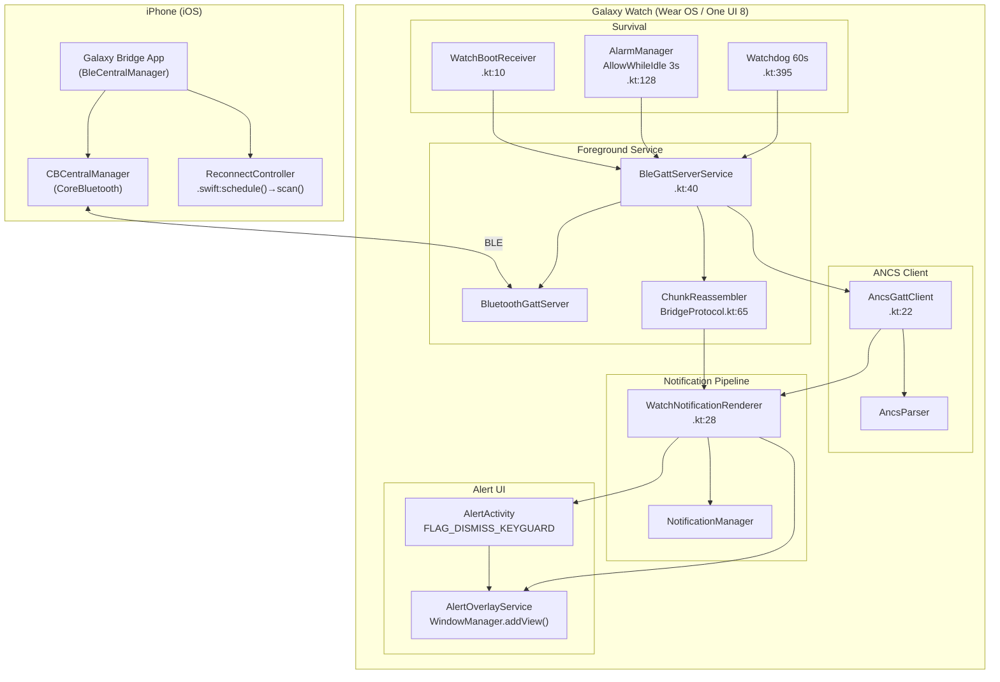
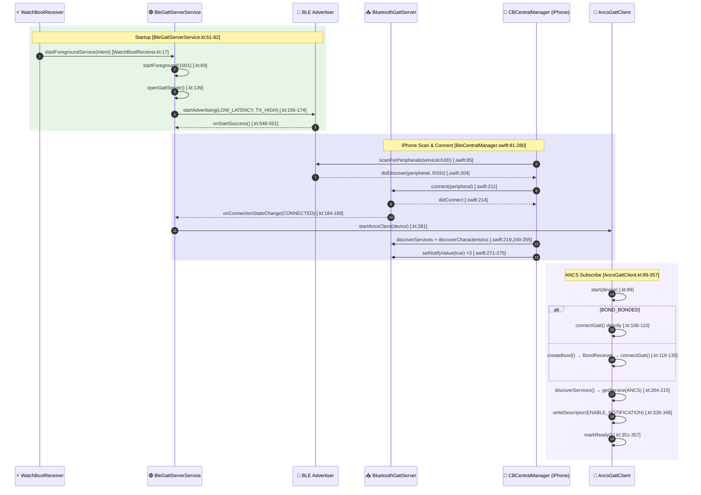
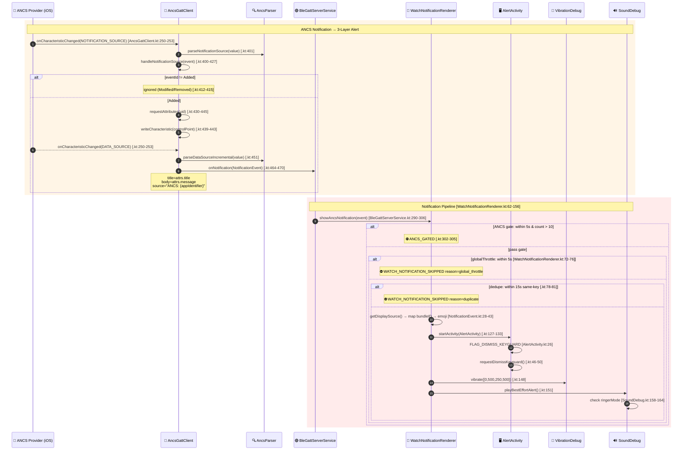
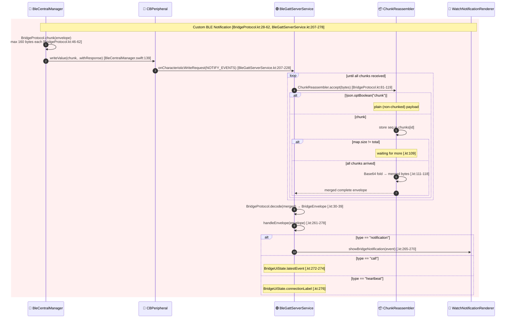
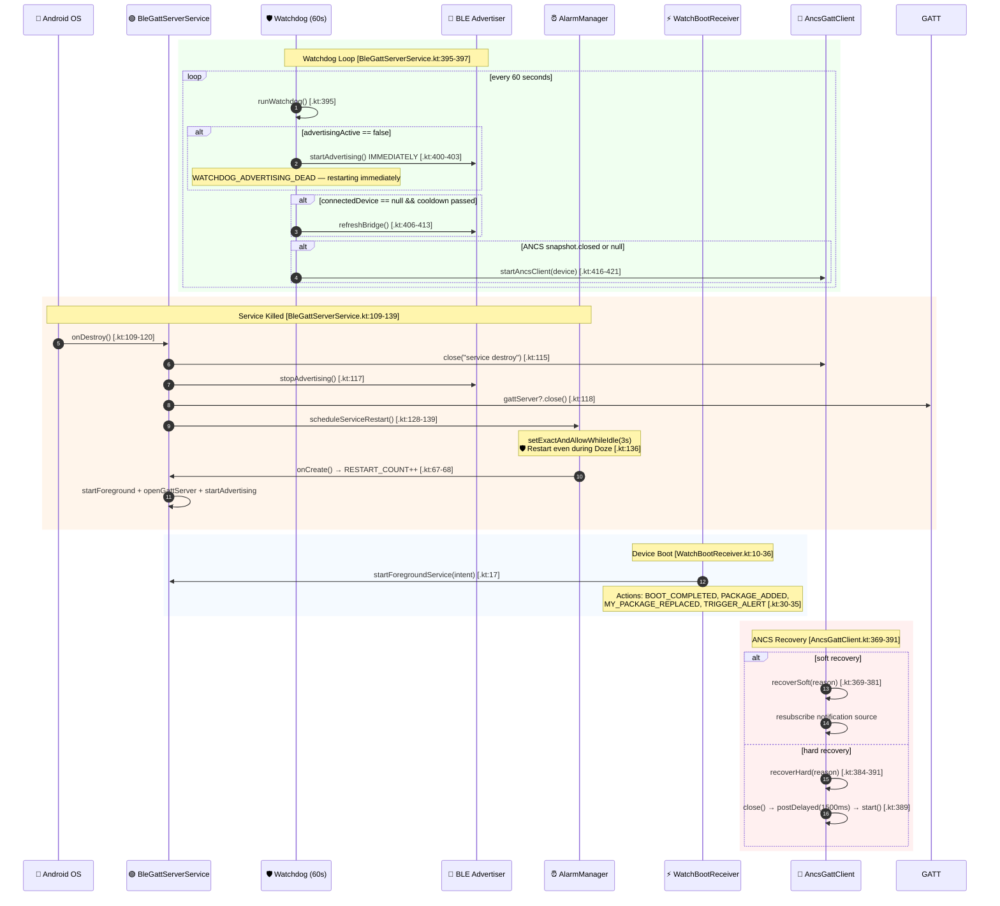

# Galaxy Bridge — BLE Architecture (L0–L5)

> ทุnode อ้างอิง file:line จริงจากโค้ด — ไม่มีการ invent

---

## L0 — System Context



| Actor | Platform | Source File |
|-------|----------|-------------|
| `BleCentralManager` | iOS | `ios-app/GalaxyBridge/Bridge/BleCentralManager.swift` |
| `BleGattServerService` | Watch | `watch-app/.../ble/BleGattServerService.kt:40` |
| `AncsGattClient` | Watch | `watch-app/.../ble/ancs/AncsGattClient.kt:22` |
| ANCS Provider | iOS System | Built-in Apple Notification Center Service |

---

## L1 — Component Architecture



---

## L2 — Connection Flow



---

## L3 — ANCS Notification → Alert



---

## L4 — Custom BLE Notification (Chunked Write)



---

## L5 — Survival & Error Recovery



---

## Key Constants (All Levels)

| Constant | Value | Source |
|----------|-------|--------|
| `CHUNK_SIZE` | 160 bytes | `BridgeProtocol.kt:28` |
| `GLOBAL_THROTTLE_MS` | 5,000 | `WatchNotificationRenderer.kt:271` |
| `DEDUPE_WINDOW_MS` | 15,000 | `WatchNotificationRenderer.kt:272` |
| `ANC_NEW_CONNECTION_WINDOW_MS` | 5,000 | `BleGattServerService.kt:597` |
| `MAX_ANC_NEW_NOTIFICATIONS` | 10 | `BleGattServerService.kt:598` |
| `WATCHDOG_INTERVAL_MS` | 60,000 | `BleGattServerService.kt:581` |
| `HEARTBEAT_INTERVAL_MS` | 15,000 | `BleGattServerService.kt:579` |
| `AUTO_DISMISS_MS` | 30,000 | `AlertActivity.kt:94` |
| `SERVICE_RESTART_DELAY_MS` | 3,000 | `BleGattServerService.kt:136` |
| `BOND_TIMEOUT_MS` | 30,000 | `AncsProfile.kt:29` |
| `CONNECT_TIMEOUT_MS` | 15,000 | `AncsProfile.kt:28` |
| `VIBRATION_PATTERN` | `[0,500,250,500]` | `WatchNotificationRenderer.kt:276` |

## BLE UUIDs

| Name | UUID | Source |
|------|------|--------|
| `SERVICE_UUID` | `8F0E7A10-4B6D-4F0B-9C2E-7F4C0A11B001` | `BridgeGattProfile.kt:6` |
| `NOTIFY_EVENTS_UUID` | `8F0E7A11...` | `BridgeGattProfile.kt:7` |
| `CALL_CONTROL_UUID` | `8F0E7A12...` | `BridgeGattProfile.kt:8` |
| `HEALTH_SAMPLES_UUID` | `8F0E7A13...` | `BridgeGattProfile.kt:9` |
| `HEARTBEAT_UUID` | `8F0E7A14...` | `BridgeGattProfile.kt:10` |
| ANCS `SERVICE_UUID` | `7905F431...` | `AncsProfile.kt:6` |
| ANCS `NOTIFICATION_SOURCE_UUID` | `9FBF120D...` | `AncsProfile.kt:7` |
| ANCS `CONTROL_POINT_UUID` | `69D1D8F3...` | `AncsProfile.kt:8` |
| ANCS `DATA_SOURCE_UUID` | `22EAC6E9...` | `AncsProfile.kt:9` |

## Test Commands

```bash
# Render L0-L5 diagrams
# Option 1: Open in browser
open https://mermaid.live

# Option 2: Use mermaid CLI (install: npm i -g @mermaid-js/mermaid-cli)
cd docs
for lvl in L0 L1 L2 L3 L4 L5; do
  mmdc -i ble-bridge-diagrams.md -o ble-bridge-${lvl}.png
done

# Option 3: Use mermaid.ink API
# Extract each diagram block and POST to https://mermaid.ink/generate