# Galaxy Bridge — BLE Architecture Swimlane Diagram

> Generated 2026-05-31 — Every node traces to actual code in this repository.  
> `%% UNCLEAR` and `%% ASSUMED` markers indicate areas needing review.

## Full Swimlane Sequence

```mermaid
sequenceDiagram
    autonumber
    box iPhone (iOS)
        participant App as 📱 BleCentralManager<br/>Swift
        participant IOS_BLE as 🔵 CBCentralManager<br/>CoreBluetooth
        participant ANCS_iOS as 📡 ANCS Provider<br/>iOS System
    end

    box Galaxy Watch (Wear OS / One UI 8)
        participant Boot as ⚡ WatchBootReceiver<br/>[WatchBootReceiver.kt:10]
        participant Srv as 🟢 BleGattServerService<br/>[BleGattServerService.kt:40]
        participant Adv as 📶 BLE Advertiser<br/>[BleGattServerService.kt:156]
        participant GATT as 📥 BluetoothGattServer<br/>[BleGattServerService.kt:183]
        participant Proto as 📦 ChunkReassembler<br/>[BridgeProtocol.kt:65]
        participant ANCS_C as 📡 AncsGattClient<br/>[AncsGattClient.kt:22]
        participant ANCS_Parse as 🔍 AncsParser<br/>[AncsParser.kt]
        participant Render as 🔔 WatchNotificationRenderer<br/>[WatchNotificationRenderer.kt:28]
        participant NotifMgr as 📬 NotificationManager<br/>Android Framework
        participant Alert as 🖥️ AlertActivity<br/>[AlertActivity.kt:14]
        participant Overlay as 🆘 AlertOverlayService<br/>[AlertOverlayService.kt:30]
        participant WD as 🛡️ Watchdog<br/>[BleGattServerService.kt:395]
        participant Alarm as ⏰ AlarmManager<br/>[BleGattServerService.kt:128]
    end

    %% ═══ PHASE 1: SERVICE STARTUP ═══
    rect rgb(230, 245, 230)
        Note over Boot, Adv: PHASE 1 — Service Startup & BLE Advertising
        Boot->>Srv: startForegroundService(intent)<br/>[WatchBootReceiver.kt:17]
        Srv->>Srv: onCreate() [BleGattServerService.kt:61]
        Srv->>NotifMgr: startForeground(1001)<br/>IMPORTANCE_HIGH, CATEGORY_SERVICE<br/>[BleGattServerService.kt:69]
        Srv->>Srv: openGattServer() [BleGattServerService.kt:139]
        Srv->>GATT: openGattServer(service)<br/>[BleGattServerService.kt:141]
        Note over GATT: Service UUID: 8F0E7A10-4B6D-4F0B-9C2E-7F4C0A11B001<br/>[BridgeGattProfile.kt:6]
        GATT->>GATT: addService(SERVICE_PRIMARY)<br/>characteristics: notify_events, call_control, health, heartbeat
        Srv->>Srv: startAdvertising() [BleGattServerService.kt:156]
        Srv->>Adv: startAdvertising(LOW_LATENCY, TX_HIGH)<br/>[BleGattServerService.kt:169-174]
        Adv-->>Srv: ✅ onStartSuccess() → ADVERTISING_STARTED<br/>[BleGattServerService.kt:548-551]
        Srv->>WD: scheduleWatchdog(60s) [BleGattServerService.kt:386]
        Srv->>Srv: scheduleHeartbeat(15s) [BleGattServerService.kt:366]
        Srv->>Srv: scheduleHealthPublish(30s) [BleGattServerService.kt:375]
    end

    %% ═══ PHASE 2: iPhone SCAN & CONNECT ═══
    rect rgb(230, 230, 250)
        Note over App, GATT: PHASE 2 — iPhone Scans & Connects via BLE
        App->>IOS_BLE: start() → scanForPeripherals(serviceUUID)<br/>[BleCentralManager.swift:81-86]
        IOS_BLE->>Adv: 📶 scans for GalaxyBridge service UUID
        Adv-->>IOS_BLE: didDiscover(peripheral, RSSI)<br/>[BleCentralManager.swift:204]
        IOS_BLE->>GATT: connect(peripheral)<br/>[BleCentralManager.swift:211]
        GATT-->>IOS_BLE: ✅ didConnect(peripheral)<br/>[BleCentralManager.swift:214]
        GATT-->>Srv: onConnectionStateChange(CONNECTED)<br/>[BleGattServerService.kt:184-189]
        Srv->>Srv: startAncsClient(device)<br/>[BleGattServerService.kt:281]
        IOS_BLE->>GATT: discoverServices(serviceUUID)<br/>[BleCentralManager.swift:219]
        GATT-->>IOS_BLE: didDiscoverServices()<br/>[BleCentralManager.swift:247-255]
        IOS_BLE->>GATT: discoverCharacteristics(notify_events, call_control, health, heartbeat)<br/>[BleCentralManager.swift:249-255]
        GATT-->>IOS_BLE: didDiscoverCharacteristicsFor()<br/>[BleCentralManager.swift:258]
        IOS_BLE->>GATT: setNotifyValue(true) for callControl, health, heartbeat<br/>[BleCentralManager.swift:271-275]
        IOS_BLE-->>App: status = "Connected" [BleCentralManager.swift:280]
    end

    %% ═══ PHASE 2b: ANCS BOND & SUBSCRIBE ═══
    rect rgb(245, 240, 255)
        Note over Srv, ANCS_C: PHASE 2b — ANCS Bond & Subscribe (Watch side)
        Srv->>ANCS_C: AncsGattClient(this, onNotification) [AncsGattClient.kt:22-25]
        Srv->>ANCS_C: start(device) [AncsGattClient.kt:89]
        ANCS_C->>ANCS_C: state = WaitingForBond [AncsGattClient.kt:100]
        alt device.bondState == BOND_BONDED
            ANCS_C->>ANCS_C: connectGatt() directly [AncsGattClient.kt:106-110]
        else not bonded
            ANCS_C->>ANCS_C: registerBondReceiver() [AncsGattClient.kt:121]
            ANCS_C->>ANCS_C: device.createBond() [AncsGattClient.kt:129]
            ANCS_C->>ANCS_C: BOND_TIMEOUT: 30s [AncsProfile.kt:29]
            Note over ANCS_C: bondReceiver → onReceive(BOND_BONDED)<br/>→ connectGatt() [AncsGattClient.kt:72-76]
        end
        ANCS_C->>ANCS_C: connectGatt() → target.connectGatt(false)<br/>TRANSPORT_LE [AncsGattClient.kt:156-174]
        ANCS_C->>ANCS_C: onConnectionStateChange(CONNECTED)<br/>→ discoverServices() [AncsGattClient.kt:178-182]
        ANCS_C->>ANCS_C: discoverServices() → gatt.discoverServices()<br/>[AncsGattClient.kt:264-277]
        ANCS_C->>ANCS_C: onServicesDiscovered() → getService(ANCS)<br/>[AncsGattClient.kt:193-215]
        ANCS_C->>ANCS_C: subscribeAfterDiscovery()<br/>[AncsGattClient.kt:293-308]
        Note over ANCS_C: setCharacteristicNotification(true)<br/>writeDescriptor(ENABLE_NOTIFICATION)<br/>[AncsGattClient.kt:338-348]
        ANCS_C->>ANCS_C: onDescriptorWrite(SUCCESS)<br/>→ subscribeDataSourceOrReady()<br/>[AncsGattClient.kt:217-227]
        ANCS_C->>ANCS_C: markReady() → state = Ready<br/>[AncsGattClient.kt:351-357]
    end

    %% ═══ PHASE 3a: ANCS NOTIFICATION FORWARDING ═══
    rect rgb(255, 245, 230)
        Note over ANCS_iOS, Render: PHASE 3a — ANCS Notification → Watch Alert
        ANCS_iOS->>ANCS_C: 📩 onCharacteristicChanged(NOTIFICATION_SOURCE)<br/>[AncsGattClient.kt:250-253]
        ANCS_C->>ANCS_Parse: parser.parseNotificationSource(value)<br/>→ AncsNotificationEvent [AncsGattClient.kt:401]
        ANCS_C->>ANCS_C: handleNotificationSource(event)<br/>[AncsGattClient.kt:400-427]

        alt event.eventId != AncsEventId.Added
            ANCS_C-->>ANCS_C: ignored (Modified/Removed) [AncsGattClient.kt:412-415]
        else eventId == Added AND controlPoint + dataSource exist
            ANCS_C->>ANCS_C: requestAttributes(uid)<br/>[AncsGattClient.kt:430-445]
            ANCS_C->>ANCS_C: buildGetNotificationAttributesRequest(uid)<br/>[AncsParser.kt]
            ANCS_C->>ANCS_C: writeCharacteristic(controlPoint)<br/>[AncsGattClient.kt:439-443]
            Note over ANCS_iOS: iOS sends data response
            ANCS_iOS-->>ANCS_C: onCharacteristicChanged(DATA_SOURCE)<br/>[AncsGattClient.kt:250-253]
            ANCS_C->>ANCS_Parse: parser.parseDataSourceIncremental(value)<br/>→ ParsedAncsAttributes [AncsGattClient.kt:451]
            ANCS_C->>ANCS_C: handleDataSource(value) [AncsGattClient.kt:447-471]
            ANCS_C->>Render: onNotification(NotificationEvent)<br/>title=attrs.title, body=attrs.message,<br/>source="ANCS: ${attrs.appIdentifier}"<br/>[AncsGattClient.kt:464-470]
        else no controlPoint/dataSource
            ANCS_C->>Render: onNotification(NotificationEvent)<br/>fallback: title="ANCS notification"<br/>[AncsGattClient.kt:419-426]
        end
    end

    %% ═══ PHASE 3b: CUSTOM BLE NOTIFICATION ═══
    rect rgb(255, 240, 240)
        Note over App, Render: PHASE 3b — Custom BLE Notification (iPhone → Watch via chunked write)
        App->>App: BridgeProtocol.chunk(envelope)<br/>max 160 bytes [BridgeProtocol.kt:46-62]
        App->>IOS_BLE: writeValue(chunk, .withResponse)<br/>[BleCentralManager.swift:139]
        IOS_BLE->>GATT: chunked write (160 bytes each)<br/>NOTIFY_EVENTS_UUID
        GATT->>Srv: onCharacteristicWriteRequest(NOTIFY_EVENTS)<br/>[BleGattServerService.kt:207-228]
        Srv->>Proto: ChunkReassembler.accept(bytes)<br/>[BridgeProtocol.kt:81-119]
        alt chunk incomplete (map.size != total)
            Proto-->>Srv: null → waiting for more [BridgeProtocol.kt:109]
        else all chunks received
            Proto-->>Srv: merged bytes [BridgeProtocol.kt:111-118]
            Srv->>Srv: BridgeProtocol.decode(merged)<br/>→ BridgeEnvelope [BridgeProtocol.kt:30-39]
            Srv->>Srv: handleEnvelope(envelope)<br/>[BleGattServerService.kt:261-278]
            alt envelope.type == "notification"
                Srv->>Render: showBridgeNotification(event)<br/>[BleGattServerService.kt:265-270]
            else envelope.type == "call"
                Srv->>Srv: BridgeUiState.latestEvent [BleGattServerService.kt:272-274]
            else envelope.type == "heartbeat"
                Srv->>Srv: BridgeUiState.connectionLabel [BleGattServerService.kt:276]
            end
        end
    end

    %% ═══ PHASE 4: NOTIFICATION PIPELINE & RENDERING ═══
    rect rgb(255, 235, 235)
        Note over Render, Overlay: PHASE 4 — Notification Pipeline (Throttle → Dedupe → 3-Layer Render)
        Srv->>Render: queueLatestNotification(event, dedupeKey)<br/>[BleGattServerService.kt:303-307]

        Render->>Render: shouldSkip(dedupeKey)?<br/>DEDUPE_WINDOW_MS=15s<br/>[WatchNotificationRenderer.kt:205-211]
        alt skip (duplicate within 15s)
            Render-->>Render: ⛔ WATCH_NOTIFICATION_SKIPPED reason=duplicate
        else globalThrottle check
            Render->>Render: globalThrottle? GLOBAL_THROTTLE_MS=5s<br/>[WatchNotificationRenderer.kt:71-76]
            alt skip (within 5s)
                Render-->>Render: ⛔ WATCH_NOTIFICATION_SKIPPED reason=global_throttle
            else pass throttle
                Render->>Render: getDisplaySource() → map bundleID → emoji<br/>[NotificationEvent.kt:28-43] [SOURCE_MAP: 40+ apps]
                Render->>Render: cleanDisplayText() [NotificationEvent.kt:45-50]
                Render->>NotifMgr: NotificationCompat.Builder<br/>CATEGORY_ALARM, PRIORITY_MAX<br/>setFullScreenIntent(alertIntent, true)<br/>[WatchNotificationRenderer.kt:82-105]
                NotifMgr->>NotifMgr: notify(uniqueTag, notificationId, notification)<br/>[WatchNotificationRenderer.kt:107]

                Render->>Alert: startActivity(AlertActivity)<br/>FLAG_DISMISS_KEYGUARD<br/>[WatchNotificationRenderer.kt:127-133]
                Alert->>Alert: FLAG_DISMISS_KEYGUARD [AlertActivity.kt:26]
                Alert->>Alert: setShowWhenLocked(true)<br/>setTurnScreenOn(true) [AlertActivity.kt:30-31]
                Alert->>Alert: KeyguardManager.requestDismissKeyguard()<br/>[AlertActivity.kt:46-50]
                Alert->>Alert: AlertScreen (Compose) — source / title / body<br/>[AlertScreen.kt:17-77]

                Render->>Overlay: startService(AlertOverlayService)<br/>[WatchNotificationRenderer.kt:142-145]
                Overlay->>Overlay: check canDrawOverlays()<br/>[AlertOverlayService.kt:62-66]
                Overlay->>Overlay: WindowManager.addView(alertView)<br/>TYPE_APPLICATION_OVERLAY<br/>[AlertOverlayService.kt:97-128]
                Overlay->>Overlay: WakeLock.acquire(30s)<br/>[AlertOverlayService.kt:130-144]

                Render->>Render: VibrationDebug.vibrate()<br/>pattern=[0,500,250,500]<br/>[WatchNotificationRenderer.kt:148]
                Render->>Render: SoundDebug.playBestEffortAlert()<br/>ToneGenerator(STREAM_ALARM)<br/>checks ringerMode<br/>[WatchNotificationRenderer.kt:151]
            end
        end
    end

    %% ═══ PHASE 5: DISCONNECT & AUTO-RECONNECT ═══
    rect rgb(245, 245, 245)
        Note over IOS_BLE, Srv: PHASE 5 — Disconnect & Auto-Reconnect
        IOS_BLE-->>IOS_BLE: didDisconnectPeripheral(error?)<br/>[BleCentralManager.swift:222-227]
        IOS_BLE->>App: ReconnectController.schedule() → scan()<br/>[BleCentralManager.swift:226]
        GATT-->>Srv: onConnectionStateChange(DISCONNECTED)<br/>[BleGattServerService.kt:190-194]
        Srv->>ANCS_C: close("custom bridge disconnected")<br/>[BleGattServerService.kt:192-193]
        Srv->>ANCS_C: ancsGattClient = null [BleGattServerService.kt:193]

        Note over IOS_BLE: ReconnectController retries scan()
        IOS_BLE->>Adv: scanForPeripherals(serviceUUID)
        Adv-->>IOS_BLE: didDiscover → connect() → ...
    end

    %% ═══ PHASE 6: SURVIVAL MECHANISMS ═══
    rect rgb(240, 255, 240)
        Note over WD, Alarm: PHASE 6 — Service Survival (Watchdog + AlarmManager)
        WD->>WD: runWatchdog() every 60s<br/>[BleGattServerService.kt:395-397]

        alt advertisingActive == false
            WD->>Adv: startAdvertising() IMMEDIATELY<br/>[BleGattServerService.kt:400-403]
            Note over WD: WATCHDOG_ADVERTISING_DEAD — restarting immediately
        end

        alt connectedDevice == null
            WD->>Adv: refreshBridge() if cooldown passed<br/>[BleGattServerService.kt:406-413]
        end

        alt ANCS snapshot.closed or null
            WD->>Srv: startAncsClient(device) [BleGattServerService.kt:416-421]
        end

        alt service onDestroy() called (OS kill)
            Srv->>Alarm: scheduleServiceRestart()<br/>setExactAndAllowWhileIdle(3s)<br/>[BleGattServerService.kt:128-139]
            Note over Srv: 🛡️ AllowWhileIdle: restarts even during Doze<br/>[BleGattServerService.kt:136]
            Alarm->>Srv: onCreate() → RESTART_COUNT++<br/>[BleGattServerService.kt:67-68]
        end

        alt device rebooted
            Boot->>Srv: startForegroundService(intent)<br/>BOOT_COMPLETED / PACKAGE_ADDED<br/>[WatchBootReceiver.kt:13-17]
        end
    end

    Note over App,Srv: ═══════════ BLE Radio ═══════════<br/>Custom Bridge: SERVICE_UUID=8F0E7A10<br/>Chunk size: 160 bytes [BridgeProtocol.kt:28]<br/>ANCS: SERVICE_UUID=7905F431 [AncsProfile.kt:6]
```

---

## DISCOVERY SUMMARY

### Actors Found

| Actor | File | Role |
|-------|------|------|
| `BleCentralManager` (iOS) | `ios-app/GalaxyBridge/Bridge/BleCentralManager.swift` | iPhone BLE central: scan, connect, write, reconnect |
| `CBCentralManager` | iOS Framework (`CoreBluetooth`) | Apple BLE central manager |
| `ReconnectController` (iOS) | `ios-app/GalaxyBridge/Bridge/ReconnectController.swift` | Auto-reconnect scheduler |
| `BleGattServerService` (Watch) | `watch-app/.../ble/BleGattServerService.kt:40` | Foreground service: GATT server, advertising, ANCS bridge, watchdog |
| `BluetoothGattServer` | Android Framework | BLE GATT server |
| `AncsGattClient` (Watch) | `watch-app/.../ble/ancs/AncsGattClient.kt:22` | ANCS GATT client: bond, connect, subscribe, parse |
| `AncsParser` (Watch) | `watch-app/.../ble/ancs/AncsParser.kt` | Parse ANCS notification source + data source |
| `ChunkReassembler` (Watch) | `watch-app/.../ble/BridgeProtocol.kt:65` | Reassemble chunked BLE writes |
| `WatchNotificationRenderer` (Watch) | `watch-app/.../notifications/WatchNotificationRenderer.kt:28` | Notification pipeline: throttle → dedupe → 3-layer render |
| `NotificationEvent` (Watch) | `watch-app/.../ui/NotificationEvent.kt:3` | Data model + source mapping (40+ apps) |
| `AlertActivity` (Watch) | `watch-app/.../ui/AlertActivity.kt:14` | Full-screen compose alert + keyguard bypass |
| `AlertOverlayService` (Watch) | `watch-app/.../overlay/AlertOverlayService.kt:30` | WindowManager overlay fallback |
| `WatchBootReceiver` (Watch) | `watch-app/.../ble/WatchBootReceiver.kt:9` | Auto-start on boot/package added |
| `SoundDebug` (Watch) | `watch-app/.../util/SoundDebug.kt:11` | ToneGenerator beep via STREAM_ALARM |
| `VibrationDebug` (Watch) | `watch-app/.../util/VibrationDebug.kt:13` | Direct vibrate via VibratorManager |

### Entry Points

| Component | Entry | File:Line |
|-----------|-------|-----------|
| Watch Service | `onCreate()` | `BleGattServerService.kt:61` |
| Watch Service | `onStartCommand()` | `BleGattServerService.kt:84` |
| Watch Boot | `onReceive()` | `WatchBootReceiver.kt:10` |
| iOS Central | `start()` | `BleCentralManager.swift:45` |
| iOS Central | `centralManagerDidUpdateState()` | `BleCentralManager.swift:187` |
| ANCS Client | `start(device)` | `AncsGattClient.kt:89` |
| Alert Render | `post(event, dedupeKey)` | `WatchNotificationRenderer.kt:62` |
| Alert UI | `onCreate()` | `AlertActivity.kt:18` |
| Overlay UI | `onStartCommand()` | `AlertOverlayService.kt:55` |

### BLE UUIDs

| Name | UUID | Defined In |
|------|------|------------|
| `SERVICE_UUID` | `8F0E7A10-4B6D-4F0B-9C2E-7F4C0A11B001` | `BridgeGattProfile.kt:6` |
| `NOTIFY_EVENTS_UUID` | `8F0E7A11-4B6D-4F0B-9C2E-7F4C0A11B001` | `BridgeGattProfile.kt:7` |
| `CALL_CONTROL_UUID` | `8F0E7A12-4B6D-4F0B-9C2E-7F4C0A11B001` | `BridgeGattProfile.kt:8` |
| `HEALTH_SAMPLES_UUID` | `8F0E7A13-4B6D-4F0B-9C2E-7F4C0A11B001` | `BridgeGattProfile.kt:9` |
| `HEARTBEAT_UUID` | `8F0E7A14-4B6D-4F0B-9C2E-7F4C0A11B001` | `BridgeGattProfile.kt:10` |
| `CLIENT_CONFIG_UUID` | `00002902-0000-1000-8000-00805f9b34fb` | `BridgeGattProfile.kt:11` |
| ANCS `SERVICE_UUID` | `7905F431-B5CE-4E99-A40F-4B1E122D00D0` | `AncsProfile.kt:6` |
| ANCS `NOTIFICATION_SOURCE_UUID` | `9FBF120D-6301-42D9-8C58-25E699A21DBD` | `AncsProfile.kt:7` |
| ANCS `CONTROL_POINT_UUID` | `69D1D8F3-45E1-49A8-9821-9BBDFDAAD9D9` | `AncsProfile.kt:8` |
| ANCS `DATA_SOURCE_UUID` | `22EAC6E9-24D6-4BB5-BE44-B36ACE7C7BFB` | `AncsProfile.kt:9` |

### Data Flow Steps

1. **iOS:** `sendNotification()` → `BridgeProtocol.chunk()` → `writeValue(chunk, .withResponse)` [BleCentralManager.swift:139]
2. **Watch:** `onCharacteristicWriteRequest()` → `ChunkReassembler.accept()` [BleGattServerService.kt:207-228]
3. **Watch:** `BridgeProtocol.decode(merged)` → `BridgeEnvelope` [BridgeProtocol.kt:30]
4. **Watch:** `handleEnvelope()` → `showBridgeNotification()` [BleGattServerService.kt:261-270]
5. **Watch ANCS:** `onCharacteristicChanged(NOTIFICATION_SOURCE)` → `AncsParser.parseNotificationSource()` [AncsGattClient.kt:401]
6. **Watch ANCS:** `requestAttributes(uid)` → `writeCharacteristic(controlPoint)` [AncsGattClient.kt:430-445]
7. **Watch ANCS:** `onCharacteristicChanged(DATA_SOURCE)` → `AncsParser.parseDataSourceIncremental()` [AncsGattClient.kt:447-451]
8. **Watch ANCS:** `onNotification(NotificationEvent)` [AncsGattClient.kt:464-470]
9. **Watch:** `queueLatestNotification()` → `renderer.post(event, dedupeKey)` [BleGattServerService.kt:303-307]
10. **Watch:** `post()` → globalThrottle → dedupe → `NotificationCompat.Builder` → `startActivity(AlertActivity)` → `startService(AlertOverlayService)` → `VibrationDebug.vibrate()` → `SoundDebug.playBestEffortAlert()` [WatchNotificationRenderer.kt:62-156]
11. **Source mapping:** `NotificationEvent.getDisplaySource()` → `SOURCE_MAP` [NotificationEvent.kt:28-43, 57-140]

### Decision Points

| Condition | File:Line |
|-----------|-----------|
| `if (advertisingActive)` — skip duplicate advertising | `BleGattServerService.kt:157` |
| `if (envelope.type == "notification"/"call"/"heartbeat")` | `BleGattServerService.kt:265-277` |
| `if (!ANCS_PASSIVE_ENABLED) return` | `BleGattServerService.kt:282` |
| `if (connectedMs < ANC_NEW_CONNECTION_WINDOW_MS && count > MAX_ANC_NEW_NOTIFICATIONS)` — ANCS gate | `BleGattServerService.kt:302` |
| `if (!advertisingActive)` — watchdog restart | `BleGattServerService.kt:400` |
| `if (device.bondState == BOND_BONDED)` — ANCS bond check | `AncsGattClient.kt:106` |
| `if (event.eventId != AncsEventId.Added)` — ANCS event filter | `AncsGattClient.kt:412` |
| `if (nowMs - lastPostTime < GLOBAL_THROTTLE_MS)` — throttle | `WatchNotificationRenderer.kt:72` |
| `if (shouldSkip(dedupeKey))` — dedupe | `WatchNotificationRenderer.kt:78` |
| `if (!canDrawOverlays())` — overlay permission | `AlertOverlayService.kt:62` |
| `if (ringerMode == SILENT/VIBRATE)` — sound gate | `SoundDebug.kt:158-164` |
| `if (!chunk)` — ChunkReassembler byte check | `BridgeProtocol.kt:83` |
| `if (map.size != total)` — chunk incomplete | `BridgeProtocol.kt:109` |

### Cross-Boundary Calls

| Caller | BLE Operation | Receiver | File:Line |
|--------|---------------|----------|-----------|
| iOS `CBCentralManager` | `scanForPeripherals(serviceUUID)` | Watch `Advertiser` | `BleCentralManager.swift:85` |
| iOS `CBCentralManager` | `connect(peripheral)` | Watch `GATT Server` | `BleCentralManager.swift:211` |
| iOS `CBPeripheral` | `discoverServices()` | Watch `GATT Server` | `BleCentralManager.swift:219` |
| iOS `CBPeripheral` | `setNotifyValue(true)` | Watch `GATT Server` | `BleCentralManager.swift:271` |
| iOS `CBPeripheral` | `writeValue(chunk, .withResponse)` | Watch `GATT Server` | `BleCentralManager.swift:139` |
| Watch `gattServer` | `notifyCharacteristicChanged()` | iOS `CBPeripheral` | `BleGattServerService.kt:463` |
| Watch `gattServer` | `sendResponse()` | iOS `CBPeripheral` | `BleGattServerService.kt:226` |
| Watch `AncsGattClient` | `connectGatt()` | iOS `ANCS Service` | `AncsGattClient.kt:174` |
| Watch `AncsGattClient` | `writeDescriptor(ENABLE_NOTIFICATION)` | iOS `ANCS Service` | `AncsGattClient.kt:345` |
| Watch `AncsGattClient` | `writeCharacteristic(controlPoint)` | iOS `ANCS Service` | `AncsGattClient.kt:440` |
| iOS `ANCS Provider` | `onCharacteristicChanged(NOTIFICATION_SOURCE)` | Watch `AncsGattClient` | `AncsGattClient.kt:251-252` |
| iOS `ANCS Provider` | `onCharacteristicChanged(DATA_SOURCE)` | Watch `AncsGattClient` | `AncsGattClient.kt:251-252` |

### Error / Edge Case Paths

| Error | Handler | File:Line |
|-------|---------|-----------|
| BLE Advertising failed | `onStartFailure(errorCode)` → `advertisingActive = false` | `BleGattServerService.kt:559-564` |
| Advertising silently stopped | Watchdog: `if (!advertisingActive) startAdvertising()` | `BleGattServerService.kt:400-403` |
| ANCS bond timeout (30s) | `failAndClose("bond timeout")` | `AncsGattClient.kt:122-128` |
| ANCS connect timeout (15s) | `failAndClose("connect timeout")` | `AncsGattClient.kt:167-172` |
| ANCS service discovery failed | `retryOrUnavailable()` → retry 2× with delays | `AncsGattClient.kt:280-291` |
| ANCS CCCD write failed | `failAndClose("notification source subscribe failed")` | `AncsGattClient.kt:232` |
| ANCS too many timeouts (>3) | `failAndClose("too many timeouts")` | `AncsGattClient.kt:30-33` |
| ANCS soft recovery | `recoverSoft()` → resubscribe | `AncsGattClient.kt:369-381` |
| ANCS hard recovery | `close() → postDelayed → start()` | `AncsGattClient.kt:384-391` |
| Chunk duplicate >3× | `droppedIds.add(id)` → discard message | `BridgeProtocol.kt:99-105` |
| Service killed by OS | `onDestroy()` → `scheduleServiceRestart()` → `setExactAndAllowWhileIdle(3s)` | `BleGattServerService.kt:109-120, 128-139` |
| Service task removed | `onTaskRemoved()` → `scheduleServiceRestart()` | `BleGattServerService.kt:121-124` |
| ANCS flood on connect | `ANCS_GATED` → skip (max 10 in 5s) | `BleGattServerService.kt:301-305` |
| Global notification throttle | `WATCH_NOTIFICATION_SKIPPED reason=global_throttle` | `WatchNotificationRenderer.kt:72-76` |
| Dedupe throttle | `WATCH_NOTIFICATION_SKIPPED reason=duplicate` | `WatchNotificationRenderer.kt:78-81` |
| Overlay permission missing | `canDrawOverlays()` → `stopSelf()` | `AlertOverlayService.kt:62-66` |
| Ringer mode silent/vibrate | `ringerMode check` → skip sound | `SoundDebug.kt:158-164` |

### Key Constants

| Constant | Value | Defined In |
|----------|-------|------------|
| `CHUNK_SIZE` | 160 bytes | `BridgeProtocol.kt:28` |
| `GLOBAL_THROTTLE_MS` | 5,000 | `WatchNotificationRenderer.kt:271` |
| `DEDUPE_WINDOW_MS` | 15,000 | `WatchNotificationRenderer.kt:272` |
| `ANC_NEW_CONNECTION_WINDOW_MS` | 5,000 | `BleGattServerService.kt:597` |
| `MAX_ANC_NEW_NOTIFICATIONS` | 10 | `BleGattServerService.kt:598` |
| `WATCHDOG_INTERVAL_MS` | 60,000 | `BleGattServerService.kt:581` |
| `HEARTBEAT_INTERVAL_MS` | 15,000 | `BleGattServerService.kt:579` |
| `AUTO_DISMISS_MS` | 30,000 | `AlertActivity.kt:94` |
| `SERVICE_RESTART_DELAY_MS` | 3,000 | `BleGattServerService.kt:136` |

### UNCLEAR Markers

- `%% UNCLEAR: AncsParser.kt — need to verify exact buildGetNotificationAttributesRequest format`
- `%% UNCLEAR: WatchScreen.kt — not directly involved in BLE notification flow; may be legacy UI`
- `%% UNCLEAR: AncsProbeClient.kt — appears to be test/debug utility; not used in production flow`

### ASSUMED Markers

- `%% ASSUMED: iOS ANCS Provider sends data asynchronously after writeCharacteristic(controlPoint) — standard ANCS behavior, not explicitly visible in iOS code`
- `%% ASSUMED: ReconnectController uses exponential backoff — confirmed by [ReconnectController.swift] but exact intervals may vary`