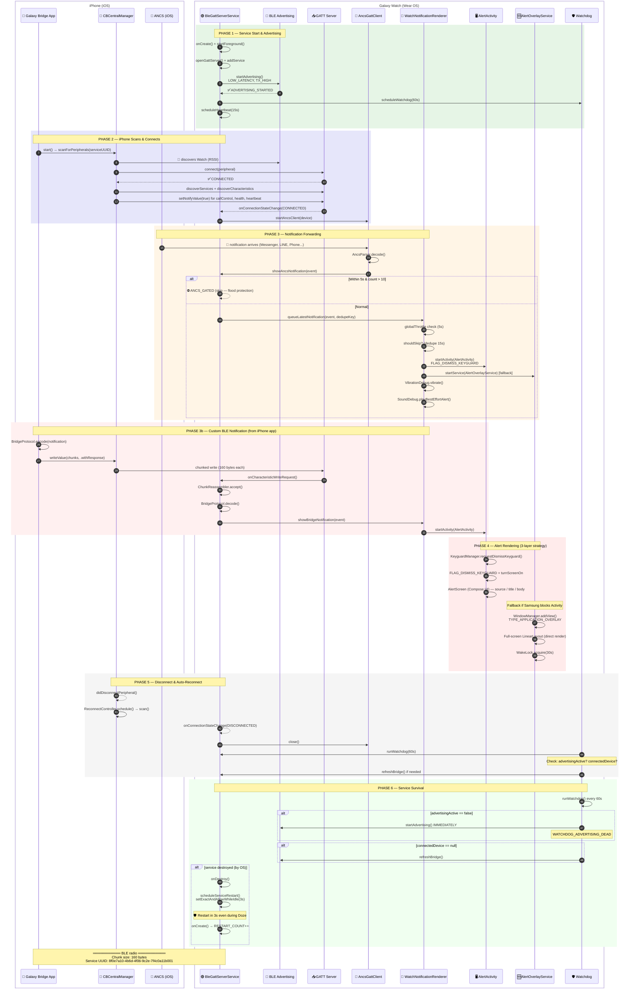
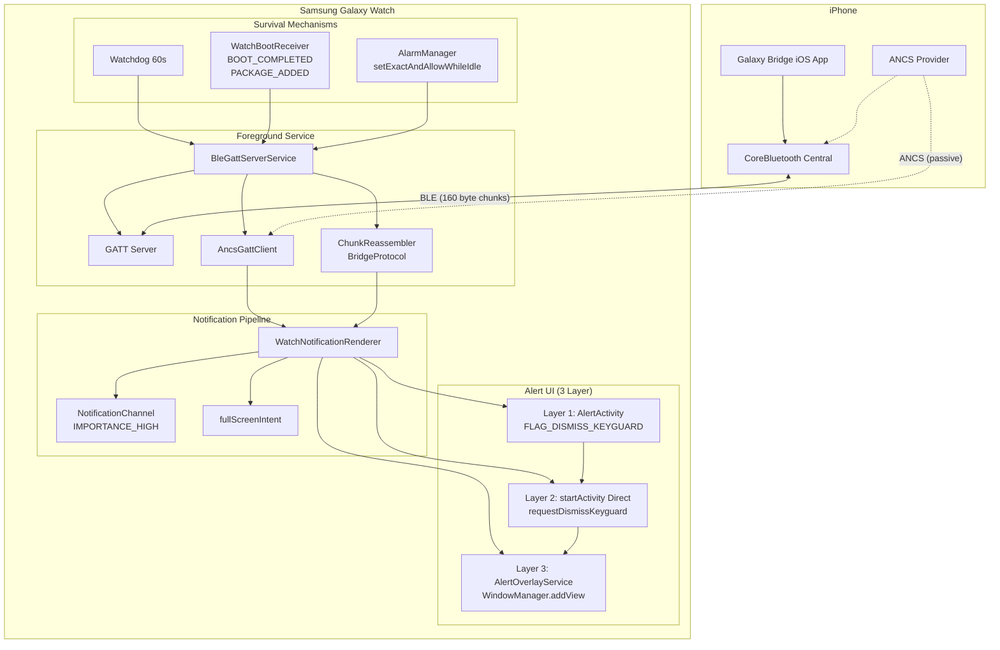
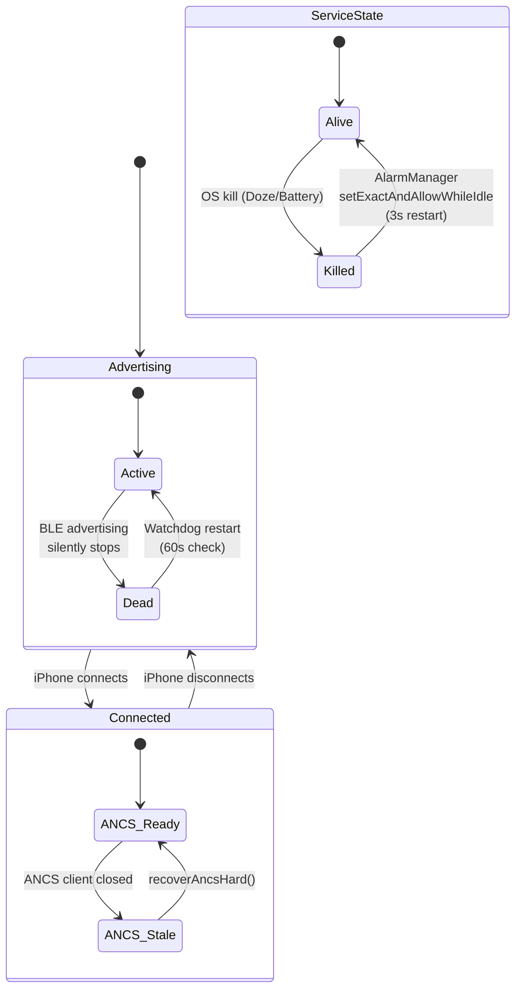
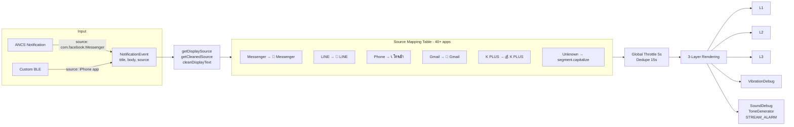

# Galaxy Bridge — BLE Architecture Flow

> Mermaid swimlane diagram for iPhone ↔ Samsung Galaxy Watch BLE bridge

## Sequence Diagram



## Layer Architecture



## State Machine — Watchdog



## Data Flow — NotificationEvent



---

## Key Constants

| Constant | Value | Purpose |
|----------|-------|---------|
| `GLOBAL_THROTTLE_MS` | 5,000 | Max 1 alert every 5 seconds |
| `DEDUPE_WINDOW_MS` | 15,000 | Same-key dedupe window |
| `ANC_NEW_CONNECTION_WINDOW_MS` | 5,000 | ANCS flood gate window |
| `MAX_ANC_NEW_NOTIFICATIONS` | 10 | Max ANCS notifications in window |
| `AUTO_DISMISS_MS` | 30,000 | Alert auto-close |
| `WATCHDOG_INTERVAL_MS` | 60,000 | Health check frequency |
| `HEARTBEAT_INTERVAL_MS` | 15,000 | BLE heartbeat |
| `SERVICE_RESTART_DELAY_MS` | 3,000 | After OS kill |

## Test Commands

```bash
# Direct AlertActivity test
adb shell am start -n com.localbridge.watch/.ui.AlertActivity \
  -e alert_title "Test" -e alert_body "Hello" -e alert_source "ADB"

# Overlay fallback test (requires SYSTEM_ALERT_WINDOW permission)
adb shell am startservice -n com.localbridge.watch/.overlay.AlertOverlayService \
  -e alert_title "Overlay" -e alert_body "Direct render" -e alert_source "ADB"

# Automated 8-checkpoint test loop
bash scripts/debug_loop.sh

# Monitor service health
adb logcat -d | grep "GB_DIAG_HEARTBEAT\|WATCHDOG_ADVERTISING_DEAD\|SERVICE_RESTARTED"